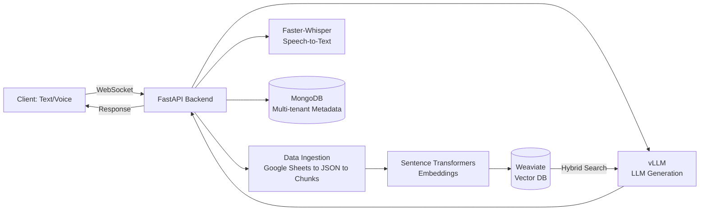

# SERVIA — Enterprise AI Customer Experience Platform


A multi-tenant, production-oriented AI platform for automating customer support. SERVIA combines Retrieval-Augmented Generation (RAG), multi-modal input (text + voice), and a scalable microservice architecture to deliver context-aware, multi-lingual customer support at scale.

## Table of Contents
- [Overview](#overview)
- [Architecture](#architecture)
- [Key Features](#key-features)
- [Tech Stack](#tech-stack)
- [Getting Started](#getting-started)
- [API Usage](#api-usage)
- [Project Structure](#project-structure)
- [Roadmap](#roadmap)
- [Contributing](#contributing)
- [License](#license)

## Overview

SERVIA ingests company-specific knowledge bases, indexes them for fast semantic retrieval, and answers customer questions in real time — through text or voice — while keeping every tenant's data isolated.

## Architecture



- **FastAPI Backend** — high-performance API + WebSocket layer
- **RAG Pipeline** — Google Sheets ingestion → chunking → Sentence Transformer embeddings → Weaviate hybrid search
- **LLM Serving** — vLLM (OpenAI-compatible) for generation, Faster-Whisper for speech-to-text
- **Multi-Tenant Storage** — MongoDB keeps each company's data logically separated
- **Containerized** — Weaviate, MongoDB, and vLLM all run via Docker Compose

## Key Features

- Multi-tenant RAG — ingest, process, and query data on a per-company basis
- Multi-modal input — text or real-time audio over WebSocket
- Automated data ingestion directly from a configured Google Sheet
- Multi-language prompt templating for system prompts and responses
- Scalable LLM serving via vLLM

## Tech Stack

| Layer | Technology |
|---|---|
| Backend | Python 3.10+, FastAPI |
| Vector DB | Weaviate |
| Metadata DB | MongoDB |
| Embeddings | Sentence Transformers |
| LLM Serving | vLLM (OpenAI-compatible API) |
| Speech-to-Text | Faster-Whisper |
| Infra | Docker, Docker Compose |

## Getting Started

### Prerequisites

- Python 3.10+
- Docker and Docker Compose
- An NVIDIA GPU (recommended for running vLLM and Whisper efficiently)

### 1. Clone and configure

```bash
git clone https://github.com/ESLAMYASSER-1/servia-ai-customer-platform.git
cd servia-ai-customer-platform
cp .env.example .env
cd docker && cp .env.example .env && cd ..
```

Set `HF_TOKEN` and `MODEL_NAME` in `docker/.env`, and your database/embedding settings in the root `.env`.

> **Security note:** Admin credentials are read from `ADMIN_USERNAME` and `ADMIN_PASSWORD` in your `.env` file. Set your own strong values before first run — never commit real credentials to the repo or document them in plaintext.

### 2. Install and run

```bash
python3 -m venv .venv && source .venv/bin/activate
pip install -r requirements.txt
cd docker && docker compose up --build -d && cd ..
chmod +x run_csab.sh && ./run_csab.sh
```

The API is now live at `http://localhost:5000`.

## API Usage

**Ingest company data**

```bash
curl -X GET "http://localhost:5000/data/start/{company_name}?Admin_name=$ADMIN_USERNAME&Admin_password=$ADMIN_PASSWORD"
```

**Chat over WebSocket** — connect to `/chat/query/{company_name}`:

```json
{ "type": "text", "content": "What are your delivery options?" }
```

Audio messages use `"type": "audio"` with a base64-encoded payload in `content`.

## Project Structure

```
servia/
├── docker/          # Docker Compose services: Weaviate, MongoDB, vLLM
├── src/             # Application source
├── .env.example
├── requirements.txt
└── run_csab.sh
```

## Roadmap

- [ ] Automated test suite
- [ ] CI/CD pipeline (GitHub Actions)
- [ ] Hosted live demo
- [ ] Admin dashboard UI

## Contributing

Issues and pull requests are welcome — see [Issues](../../issues) to get started.

## License

MIT — see [LICENSE](LICENSE).
